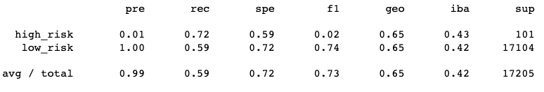
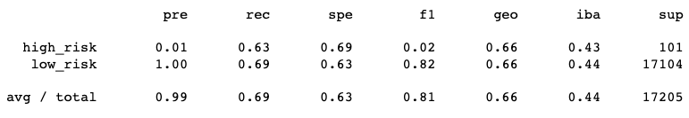
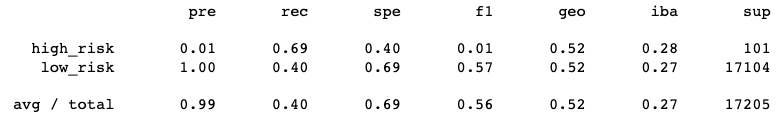
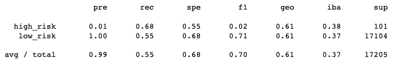
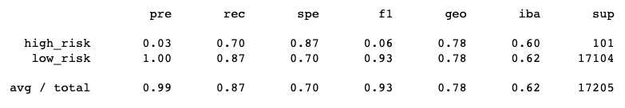
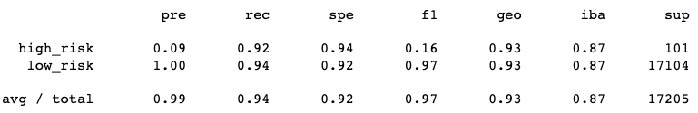

# Credit_Risk_Analysis

## Overview
LendingClub a peer to peer lending services company wants to utilize machine learning in order to predict credit card risk. Credit risk is an inherently unbalanced classification problem, as good loans easily outnumber risky loans. Therefore, it's important to employ different techniques to train and evaluate models with unbalanced classes. 

The data science team has been tasked to use imbalanced-learn and scikit-learn libraries to build and evaluate models using resampling.

Using the credit card credit dataset from LendingClub, the goal is to oversample the data using the RandomOverSampler and SMOTE algorithms, and undersample the data using the ClusterCentroids algorithm. Then, use a combinatorial approach of over- and undersampling using the SMOTEENN algorithm. The next task is to compare two new machine learning models that reduce bias, BalancedRandomForestClassifier and EasyEnsembleClassifier, to predict credit risk. 

Once done, the performance of these models needs to be evaluated. The summary below incldues a recommendation on whether they should be used to predict credit risk.

## Results

**Resampling:** 

* Random Sampler Score = 0.65

* SMOTE (Oversampling) Sampler Score = 0.66

* Cluster Centroids Score (Undersampling)= 0.54

* SMOTEENN Score (Combination Over/Under Sampling) = 0.61

**Ensemble**

* RandomForest Score = 0.78

* EasyEnsemble Score = 0.93

## Summary

The EasyEnsemble model provided the highest accuracy score, howevwer it cannot be considered a reliable model because the prediction for high-risk loans is low and many applications could be wrongly classified. Overall across all models the performance for high-risk loans was not well executed which can be contigent on the amount of data collected. There is also a big difference between the amount of data for low-risk and high-risk. When it came to undersampling the data using the Cluster Centroids method, there was no improvement in the accuracy score.

